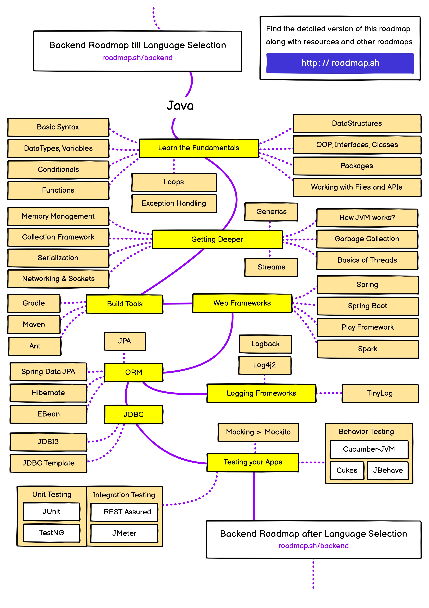

# **Pick a Language** 💻

Elegir un lenguaje de programación para comenzar en el desarrollo backend es una de las decisiones más importantes que tomarás en tu camino como desarrollador. La elección del lenguaje dependerá de tus intereses, metas profesionales y el tipo de proyectos que quieras desarrollar. Existen múltiples opciones, cada una con sus características, ventajas y ecosistemas propios. En esta sección, te ayudaré a entender por qué es crucial elegir el lenguaje adecuado y cómo hacer esta elección en función de lo que más te interese.

---

## ⭐ **La importancia de elegir un lenguaje para Backend**

El backend de una aplicación web es la parte encargada de gestionar la lógica de negocio, la base de datos y la interacción con el frontend. Para realizar estas tareas, necesitas un lenguaje de programación que te permita comunicarte con servidores, bases de datos y otros servicios externos. Existen varias opciones de lenguajes backend, y aunque todos tienen la capacidad de hacer el trabajo, cada uno tiene sus propias características que podrían hacer que se adapte mejor o peor a tus objetivos.

### **¿Por qué es importante elegir un buen lenguaje de backend?**

Elegir un lenguaje de programación backend no solo define las herramientas que usarás, sino también las tecnologías, los frameworks y las mejores prácticas que aprenderás. Además, influye en las oportunidades laborales disponibles, ya que algunas empresas prefieren un lenguaje específico por su rendimiento, escalabilidad o la naturaleza del negocio.

El primer lenguaje que elijas para backend puede marcar la diferencia en tu carrera, por lo que es importante considerar no solo las características del lenguaje, sino también el tipo de proyectos que quieres desarrollar y la demanda del mercado.

---

## ♨️ **Mi Elección: Java**

En mi caso, he decidido comenzar con **Java** como lenguaje de programación para backend. Java es ampliamente utilizado en el desarrollo de sistemas empresariales, aplicaciones Android y servicios web, lo que lo convierte en una opción robusta y escalable para cualquier desarrollador backend. A través de este artículo y el contenido de la sección "Pick a Language", vamos a enfocarnos principalmente en Java, siguiendo el roadmap de Java proporcionado por [roadmap.sh](https://roadmap.sh/backend).

Java es conocido por su capacidad para construir aplicaciones de gran escala, su seguridad integrada y su portabilidad. Gracias a la máquina virtual de Java (JVM), el código Java puede ejecutarse en cualquier dispositivo que tenga una JVM instalada, lo que lo convierte en un lenguaje versátil para sistemas distribuidos y soluciones en la nube.

### **¿Por qué elegir Java?**

- **Portabilidad**: El principio "write once, run anywhere" significa que el código Java puede ejecutarse en cualquier plataforma sin necesidad de modificarlo.
- **Robustez y escalabilidad**: Java es una opción popular para grandes aplicaciones empresariales y servicios de backend que requieren alta disponibilidad y capacidad de procesamiento.
- **Gran ecosistema**: Con una enorme comunidad y una vasta biblioteca estándar, Java te ofrece herramientas poderosas para resolver problemas complejos en el desarrollo backend.
- **Seguridad**: Java tiene un sistema de seguridad bien integrado, lo que lo convierte en una opción confiable para aplicaciones sensibles.

Si decides seguir mi camino y aprender Java para backend, puedes consultar el [roadmap de Java](https://roadmap.sh/java) para ver los pasos recomendados para aprender y dominar este lenguaje.

---

## ✅ **Cómo elegir el lenguaje de backend adecuado**

Es importante que elijas el lenguaje de backend que más se ajuste a tus intereses y necesidades. Aquí hay algunas recomendaciones para guiarte en tu decisión:

- **JavaScript**: Si ya tienes experiencia en frontend y deseas unificar tu conocimiento, JavaScript podría ser una excelente opción, especialmente si te interesan tecnologías como Node.js.
- **Go**: Si buscas un lenguaje simple y eficiente para aplicaciones de alto rendimiento y sistemas distribuidos, Go (también conocido como Golang) es ideal.
- **Python**: Conocido por su facilidad de aprendizaje y versatilidad, Python es perfecto para desarrolladores que buscan un lenguaje que permita tanto el desarrollo web como la ciencia de datos.
- **Ruby**: Si te atrae la productividad y un enfoque "convención sobre configuración", Ruby con el framework Rails podría ser la mejor opción.
- **Java**: Si te interesa el desarrollo de aplicaciones empresariales de gran escala, servicios web robustos o soluciones en la nube, Java es una excelente elección.
- **C#**: Utilizado principalmente en el ecosistema de Microsoft, C# es adecuado para aplicaciones en la nube, videojuegos y sistemas integrados.
- **PHP**: A pesar de sus críticas, PHP sigue siendo un lenguaje muy popular en el desarrollo de sitios web dinámicos y sistemas de gestión de contenido (CMS) como WordPress.
- **Rust**: Si buscas un lenguaje que combine rendimiento y seguridad de memoria, Rust es ideal, especialmente para sistemas de bajo nivel o aplicaciones de alto rendimiento.

Cada lenguaje tiene su propio conjunto de ventajas y casos de uso. Considera tus metas a largo plazo, los proyectos que deseas realizar y las oportunidades laborales disponibles para cada tecnología. Una vez que elijas un lenguaje, comprométete a aprenderlo y profundiza en sus herramientas y frameworks para aprovechar al máximo sus capacidades.

---

## 🧠 **Los conocimientos son trasladables**

Es importante destacar que, aunque elijas un lenguaje específico para empezar, **los conceptos fundamentales que aprenderás serán fácilmente trasladables a otros lenguajes**. Los lenguajes de programación comparten muchas similitudes en cuanto a sus principios básicos, tales como:

- **Variables y tipos de datos**: La mayoría de los lenguajes manejan conceptos similares de variables (enteros, cadenas, booleanos) y tipos de datos.
- **Estructuras de control**: Los bucles, condicionales y estructuras de decisión son universales en todos los lenguajes de programación.
- **Paradigmas de programación**: Lenguajes como Java, Python, Ruby y Go siguen principios de programación orientada a objetos, mientras que también Go o Rust están más centrados en programación funcional y concurrente.
- **Estructuras de datos**: Listas, diccionarios, arrays, árboles, y otros tipos de colecciones son comunes a todos los lenguajes.
- **Manejo de excepciones**: La mayoría de los lenguajes tienen alguna forma de manejar errores y excepciones.

Aprender un lenguaje te enseñará a pensar como programador, a resolver problemas de manera lógica y estructurada. Esto te permitirá cambiar de un lenguaje a otro con mayor facilidad. Por ejemplo, si comienzas con Java y luego decides aprender Python o JavaScript, gran parte de tus conocimientos, como la lógica de programación, los patrones de diseño y el enfoque en la optimización del código, serán aplicables en el nuevo lenguaje.

### **Transición entre lenguajes**

Si en el futuro decides aprender otros lenguajes, la transición será mucho más sencilla. Muchos conceptos fundamentales de programación, como la programación orientada a objetos (OOP), la manipulación de datos y la interacción con bases de datos, son comunes entre los lenguajes. Por lo tanto, tu experiencia con un lenguaje solo te preparará mejor para aprender y adaptarte a otros lenguajes según sea necesario para proyectos o roles específicos.

---

## 📝 **Conclusión**

Elegir un lenguaje de backend adecuado para comenzar tu carrera en programación es fundamental. En mi caso, me he decantado por Java debido a su versatilidad y su amplio uso en aplicaciones empresariales y sistemas distribuidos. A lo largo de esta sección, te guiaré por el proceso de aprendizaje de Java, siguiendo el roadmap recomendado y brindándote los recursos necesarios para dominarlo.

Recuerda, no hay un único "mejor" lenguaje, solo el que mejor se adapte a tus intereses y objetivos. ¡Buena suerte en tu camino hacia el desarrollo backend!

---

## 🗺️ **Vista Previa del Roadmap de Java**

A continuación, puedes ver una vista previa del roadmap de Java. Haz clic en la imagen para acceder al documento completo en formato PDF:

